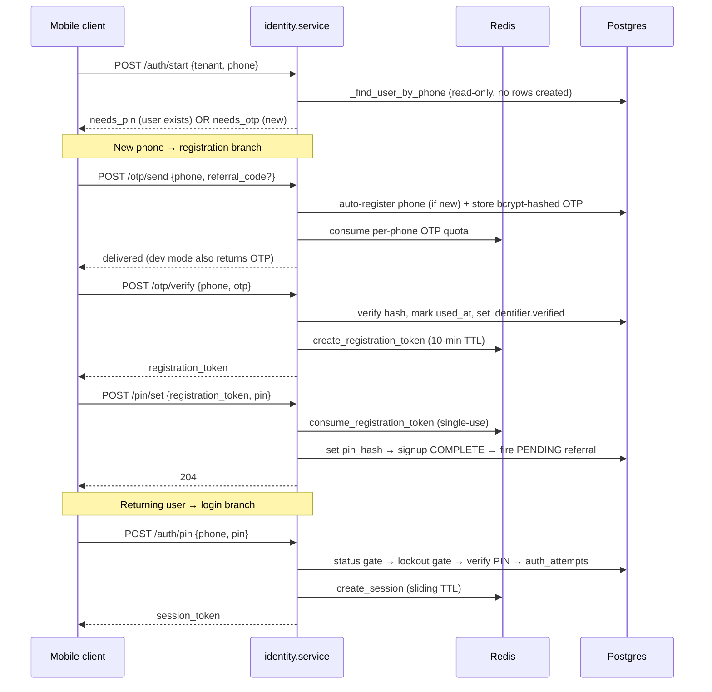

# 01 — Identity, Auth & Users

> **HOW** the identity module builds Module 1: the multi-identifier user model, the phone-first
> OTP/PIN auth flow, self-registration + referral capture, the five user types, and the admin
> user-governance surface.
> **Related:** PRD Module 1 (Pay-PRD-0010–0109) · Module 7 (access, partial) ·
> [README §5/§6](README.md) · [04 — Maker-Checker](04-maker-checker-and-approvals.md) ·
> [05 — Rewards & Referral](05-rewards-rules-and-referral.md) ·
> [`.claude/rules/compliance-fintech.md`](../../.claude/rules/compliance-fintech.md) ·
> code: `backend/app/modules/identity/`, `backend/app/auth/`, `backend/app/shared/utils/`.

Module 1 is the largest service in the backend (`modules/identity/service.py`, ~2050 lines). It owns
user lifecycle, identifiers, OTP/PIN registration, Redis-session auth, the admin user-admin verbs, and
the `/me/*` user surface. Admin CRUD is fronted by a four-eyes maker-checker layer (`user_operations`)
documented in [doc 04](04-maker-checker-and-approvals.md); here we cover the identity *mechanics* it drives.

---

## 1. The multi-identifier user model (Pay-PRD-0010–0020)

A `User` row carries no login handle of its own. Instead one user owns many `UserIdentifier` rows, each a
`(identifier_type, identifier_value, verified)` triple — `phone`, `email`, `account`, or `card`. This lets
the same person be reached by any handle they registered, and lets money paths resolve a recipient by
whatever the sender typed.

- **Tables:** `users`, `user_identifiers`, `user_profiles` (`shared/models/users.py`). Every row carries
  `tenant_id`; uniqueness is `(tenant_id, identifier_type, identifier_value)` — the same phone can exist in
  two tenants as two distinct users, and never collides across the boundary.
- **Canonicalisation — `normalize_identifier`** (`shared/utils/normalize.py`). *Every* write, lookup, and
  duplicate-guard runs the raw value through this first, so a handle stored one way always resolves later:
  - `phone` → `normalize_phone`: strips every non-digit (spaces, dashes, parens, dots, stray/duplicate
    `+`) and re-prepends exactly one `+` → canonical **E.164** (`+27825550001`). An all-punctuation input
    strips to empty so validation still rejects it rather than minting a bare `+`.
  - `email` → `strip().lower()` (case-insensitive, industry convention).
  - `account` / `card` → `strip()` only — they carry meaningful grouping characters (`ZA-001-887-2210`).
  - Without this, `"+27 82 555 0001"` and `"+27825550001"` would be different rows and lookups would
    silently miss; it also hardens tenant isolation (NFR-0220) against near-duplicate leakage.
- **Resolution — `resolve_identifier`** (service.py:1636): normalises the query, then looks up the
  identifier tenant-scoped and returns the owning user. Money services call this to turn "send to
  `+2782…`" into a `user_id` + `financial_wallet`.

---

## 2. The auth flow — phone-first, OTP then PIN, Redis session (Pay-PRD-0030–0060)

User auth is **custom** (not Keycloak — that guards admins). It is a state machine over four public
endpoints plus a registration-token-gated PIN set. All crypto lives in `backend/app/auth/`
(`hashing.py` bcrypt for PIN + OTP, `sessions.py` Redis, `tokens.py` registration + session tokens,
`lockout.py`, `rate_limit.py`).

**Key mechanics**

- **`auth_start_lookup`** (service.py:2026) is strictly read-only — unlike `send_otp` it creates **no**
  rows. It only branches the client between `needs_otp` and `needs_pin`. Both branches 404 identically on
  an unknown tenant and a cross-tenant phone returns `needs_otp`, so it can't be used to enumerate users
  across tenants.
- **`send_otp`** (service.py:1730): auto-registers a genuinely new phone (see §3), then generates an OTP,
  stores only its **bcrypt hash** (`OtpRequest.otp_hash` — the plaintext is never persisted or logged,
  NFR-0170), sets a `OTP_EXPIRY_SECONDS` TTL, and is **rate-limited per phone** in Redis
  (`consume_otp_send_quota` → `OtpRateLimited` 429). In local-dev (`OTP_DEV_RETURN`) the OTP is echoed
  so tests/demos work without an SMS gateway.
- **`verify_otp`** (service.py:1798): selects the latest **unused, unexpired** OTP for the phone, verifies
  the hash, then sets `used_at` (single-use) and flips the phone `UserIdentifier.verified = True`. Wrong,
  expired, and already-used all raise the *same* `InvalidOtp` (401) — no enumeration leak. On success it
  mints a **registration token** (10-min Redis TTL) for the one follow-up call.
- **`set_pin`** (service.py:1870) completes signup: `consume_registration_token` deletes the token
  atomically on read (single-use), the PIN is validated (`4–6` digits, `_validate_pin_format`) and stored
  as **bcrypt** `pin_hash`. It rejects a user who already has a PIN (`PinAlreadySet` 409) — it is the
  *initial-registration* PIN path only. Returns 204.
- **`authenticate_pin`** (service.py:1931) — the login path. Precedence is deliberate:
  1. **status gate** — a `suspended`/`closed` user raises `AccountSuspended` *before* any credential
     check (§6);
  2. **lockout gate** — `is_locked(user.id)` → `AccountLocked` (423) *before* comparing the PIN, so a
     locked-out attacker who happens to guess right still can't get in;
  3. verify PIN; every attempt (success or fail) writes an immutable `auth_attempts` row with IP;
     a miss calls `register_failure` (bumps the Redis counter, may trip lockout);
  4. success resets the counter and issues a **Redis session token** (`create_session`,
     `channel="mobile"`, `SESSION_TTL_SECONDS`). Sessions are validated by `get_current_user`
     (`dependencies.py`) with a **sliding TTL** — activity refreshes the window; inactivity expires it
     (NFR-0180: ≤15min mobile). Tokens live in Redis only, never in the DB, never logged.
- **`/auth/logout`** invalidates the session server-side.

---

## 3. Phone-first self-registration + referral capture (Pay-PRD-0010, Module 15)

There is no separate "sign up" endpoint for end users — the *first* `POST /otp/send` for an unknown phone
**auto-creates** the user. `send_otp` calls `_autocreate_user_with_phone` (service.py:1688), which invokes
`create_user(..., self_registration=True)`. This is the only path that sets the `self_registration` flag,
and that flag is load-bearing for referral anti-farming.

**Referral code capture.** `POST /otp/send` accepts an optional `referral_code`.

- The code is validated **only** for a genuinely new phone (`user is None`), and validated **before** the
  OTP quota is consumed (`_assert_referral_code_exists`, service.py:281) so a typo'd code returns
  `InvalidReferralCode` (422) without burning the phone's ~60s send quota. A returning user's re-send
  ignores the field entirely — an OTP re-request must never mutate an established user.
- Inside `create_user` (service.py:307), when `self_registration` **and** a code is present,
  `_resolve_referrer` (service.py:250) resolves the code to its owner tenant-scoped and rejects
  self-referral (`SelfReferralNotAllowed` 422), then a **PENDING referral** row is written. **No reward is
  issued here** — a valid code creates the link only.
- Every user also gets their *own* shareable code via `_create_unique_referral_code` (service.py:220):
  an 8-char code over a 32-symbol ambiguity-free alphabet (no `0/O/1/I`), pre-checked for collision and
  backed by the `(tenant, code)` unique constraint.

**Why the reward fires only at PIN-set (anti-farming).** The referral payout is triggered from
`set_pin` (service.py:1909), *after* the PIN is committed — i.e. only once the phone is OTP-verified **and**
signup is completed. `set_pin` calls `evaluate_referral_on_registration_complete` (both sides paid; detail
in [doc 05](05-rewards-rules-and-referral.md)). Three properties fall out:

- An unverified phone that starts signup but never sets a PIN is **never paid** (no farming with throwaway
  numbers).
- The reward fires **at most once per user**: `set_pin` rejects a user who already has a PIN, so a later
  change-PIN can't re-enter this branch, and the payout itself gates on a *PENDING* referral.
- **Admin-, external-, and maker-checker-created users are structurally excluded**: they are created with
  `self_registration=False` (no referral link is ever minted) and they never run `set_pin`, so no referral
  reward can accrue to them.
- The payout is **post-commit and fail-open** (NFR-0130): a reward error rolls back only the reward work
  and logs `referral_signup_reward_failed`; PIN-set still succeeds and the PENDING referral stays
  reconcilable.

---

## 4. Five user types + parent hierarchy (Decision D4, Epic 12)

`shared/models/users.py` defines five types: `consumer`, `agent`, `super_agent`, `merchant`,
`head_merchant` (`USER_TYPE_*`). The type is the key that type-aware **pricing** and **limits** configs
resolve against (`shared/utils/user_types.py::resolve_user_type` → falls back to `consumer`, which also
matches the `NULL`-default config row — see [doc 03](03-money-controls-pricing-limits-roles-step-up.md)).

**Hierarchy — `_validate_type_hierarchy`** (service.py:158), keyed by `PARENT_TYPE_BY_CHILD`:

| Child type | Parent rule |
|---|---|
| `consumer`, `super_agent`, `head_merchant` | parent **must be NULL** (`InvalidUserTypeParent` if set) |
| `agent` | parent optional; if set must be a `super_agent` **in the same tenant** |
| `merchant` | parent optional; if set must be a `head_merchant` **in the same tenant** |

No cross-tenant hierarchies (the parent lookup is tenant-scoped), and a user may never be its own parent.

**`change_user_type`** (service.py:591) — admin-only, tenant-scoped (unknown/other-tenant → 404 with no
existence leak), re-runs `_validate_type_hierarchy`, and is **state-idempotent**: if the user already has
the requested `(new_type, parent)` it is a no-op with no audit row (safe retries — the repo has no
non-ledger idempotency store). A real change updates `users.user_type`/`parent_user_id` and writes one
`user.type_changed` audit row. Merchant-specific guards (requiring a `merchant_profiles` row on entry;
blocking exit while a collection account is non-zero) are **deferred to Epic 17** — those tables don't
exist yet.

---

## 5. Admin user CRUD via four-eyes maker-checker (Pay-PRD-0070–0090)

Admin create/edit of users does not hit `create_user`/`admin_update_user` directly — it is proposed and
approved through **`user_operations`** (four-eyes, `required_approvals=1`), applied in one transaction on
approval. Full mechanics are in [doc 04](04-maker-checker-and-approvals.md). Two identity-specific points:

- **Duplicate-identifier guard at BOTH propose AND revise.** `_assert_create_identifiers_available`
  canonicalises every proposed identifier via the same `normalize_identifier` the apply-time insert uses,
  and rejects (`IdentifierAlreadyInUse` 409) if it is either (a) already owned by a live user or (b)
  already claimed by another *PENDING* `create_user` proposal. This stops two in-flight proposals from
  stacking on the same phone/email and only colliding at apply time. The same guard runs on `revise` so an
  edited proposal can't sneak a now-taken identifier through.
- **Apply attribution.** Approval calls identity `create_user` / `admin_update_user` with the **maker** as
  the acting admin (audit actor), `self_registration=False` — so admin-created users never mint a referral
  link (§3).

`create_user`'s own duplicate handling: identifiers are flushed *early* (service.py:397) so a
`(tenant, type, value)` collision surfaces as a clean `IdentifierAlreadyInUse` (409) pinpointing the
offending identifier, not a raw 500 from a later flush.

---

## 6. Access control — status enforcement, locks, admin remediation (Pay-PRD-0100–0109)

Two independent lock mechanisms exist; don't conflate them.

**a) Admin access-lock (`user.status`) — enforced, not cosmetic.** `POST /users/{id}/access`
(`set_user_access_level`) sets `active` / `txn_locked` / `suspended` / `closed`. Enforcement:

- **`assert_user_can_transact`** (service.py:127) is called at the **top of every user-initiated money
  path** (after the idempotency fast-path, before charge/ledger work). It loads the initiator
  tenant-scoped and rejects anything other than `active` → `TransactionsBlocked` (403). `txn_locked`,
  `suspended`, `closed` all block. **Only the initiator is guarded** — the passive receiving side of a
  transfer is not, so a locked user can still *receive* (this is intentional; see call-site comments).
- Login is gated separately inside `authenticate_pin`: `suspended`/`closed` raise `AccountSuspended`
  before credentials; `txn_locked`/`active` may log in and read (their money paths are blocked by the
  guard above).

**b) Failed-PIN auto-lockout** is orthogonal — a Redis counter (`auth/lockout.py`) tripped by consecutive
wrong PINs (`AccountLocked` 423, configurable threshold + duration, NFR-0190). It clears on the next
successful auth or via admin unlock.

**Admin remediation verbs** (all admin, tenant-scoped, audit-logged):
`POST /users/{id}/unlock` (`admin_unlock_user` — clears the auto-lockout counter),
`POST /users/{id}/pin/reset` (`admin_reset_pin`), and `set_user_access_level` above.

---

## 7. Post-registration identifiers + account-number verification (Pay-PRD-0030, Epic 27)

- **`POST /users/{id}/identifiers`** (`add_user_identifier`, service.py:1442): adds an identifier to an
  existing user, normalising first, subject to the same tenant-scoped uniqueness (dup → 409).
- **`POST /users/{id}/identifiers/verify`** (`verify_user_identifier`, service.py:1541): admin flips
  `verified=True` on an `account_number` identifier (`IdentifierNotManuallyVerifiable` 422 for types that
  don't support manual verification). This is the "account-number verify" that shipped with the unified
  approvals initiative — it lets an operator confirm a bank account handle out of band before it's usable
  as a transfer target.

---

## 8. The `/me/*` user surface

Session-authenticated read endpoints backing the mobile app: `/me/wallet` (`get_my_wallet` — balance +
recent txns), `/me/services` (`list_my_services` — services visible to this user's type/channel),
`/me/limits` (`list_my_limits` — the user's limit snapshots), and `/me/rewards` (+ `/me/rewards/seen`)
which surfaces the user's own `referral_code` and reward-celebration state (rewards-adjacent — see
[doc 05](05-rewards-rules-and-referral.md)).

---

## 9. Requirement → implementation map

| Pay-PRD | Requirement | Where |
|---|---|---|
| 0010–0020 | Multi-identifier user, canonical form | `normalize_identifier`; `user_identifiers` unique `(tenant,type,value)` |
| 0010, M15 | Phone-first self-registration + referral capture | `send_otp`→`_autocreate_user_with_phone`→`create_user(self_registration=True)` |
| 0030 | Add/verify identifiers | `add_user_identifier`, `verify_user_identifier` |
| 0040–0060 | OTP → registration token → PIN, session | `send_otp`/`verify_otp`/`set_pin`/`authenticate_pin` |
| 0070–0090 | Admin user CRUD (four-eyes) | `user_operations` → `create_user`/`admin_update_user` ([doc 04](04-maker-checker-and-approvals.md)) |
| Epic 12 | User types + parent hierarchy | `_validate_type_hierarchy`, `change_user_type` |
| 0100–0109 | Access control, lockout, remediation | `assert_user_can_transact`, `set_user_access_level`, `admin_unlock_user`, `admin_reset_pin` |
| NFR-0170/0180/0190 | No credential logging, session TTL, lockout | `auth/hashing.py`, `auth/sessions.py`, `auth/lockout.py` |
