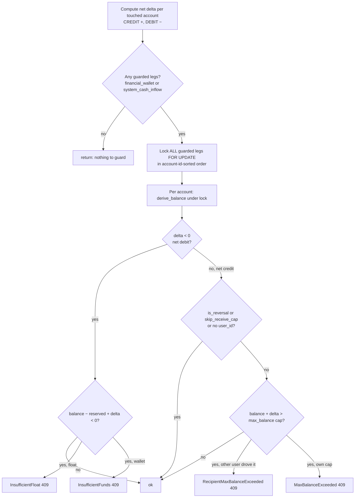
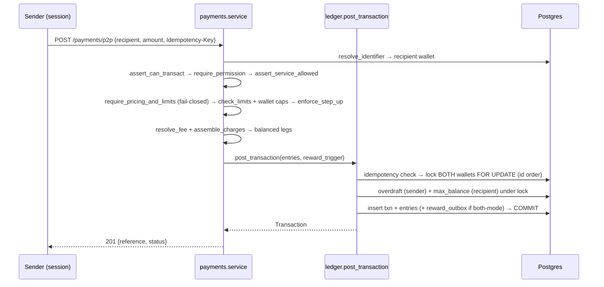

# 02 — Ledger, Accounts & Money Movement

> **HOW** the money core is built: the account model, the append-only double-entry ledger, the single
> `post_transaction` choke point + its `FOR UPDATE` balance guard, and every product money path
> (P2P, cash-in, cash-out, airtime, change-PIN, treasury).
> **Related:** PRD Modules 2 (0110–0160), 3 (0170–0240), 4 (0250–0329) · [README §5](README.md) ·
> [03 — Money Controls](03-money-controls-pricing-limits-roles-step-up.md) (fail-closed gate) ·
> [04 — Maker-Checker](04-maker-checker-and-approvals.md) (treasury governance) ·
> [07 — Redemption & Reconciliation](07-redemption-and-reconciliation.md) ·
> [`.claude/rules/ledger-invariants.md`](../../.claude/rules/ledger-invariants.md) ·
> code: `backend/app/modules/{ledger,accounts,payments,cashin,cashout,airtime,pin_change,treasury}/`.

Every movement of value in the platform funnels through **one function** — `ledger.service.post_transaction`
— and nothing writes ledger entries any other way. This doc walks the account model beneath it, that
function's exact sequence, the balance guard that serialises concurrent writers, and how each product
assembles its legs before calling it.

---

## 1. The account model + account types (Module 2, 0110–0160)

An `Account` (`shared/models/accounts.py`) is a `(tenant_id, currency, account_type, user_id?)` container.
User wallets carry a `user_id`; system/pool accounts do not. Balances are **never** stored on the row —
they are **derived** from the ledger (§2).

There are eleven account types (`ACCOUNT_TYPE_*`):

| Account type | `user_id`? | Role |
|---|---|---|
| `financial_wallet` | ✅ | a user's stored-value wallet — the everyday spend/receive account |
| `points_account` | ✅ | a user's rewards points balance |
| `provider_redemption_wallet` | — | holding for an external redemption provider ([doc 07](07-redemption-and-reconciliation.md)) |
| `system_cash_inflow` | — | **operator cash float** — pre-funded from the bank, the source of user funding |
| `airtime_merchant_holding` | — | merchant *collection* account for airtime vends |
| `system_fee_collected` | — | where operator fees land |
| `commission` | — | agent commission payouts |
| `tax_service_collected` | — | tax overlaid on the fee |
| `tax_commission_collected` | — | tax overlaid on commission |
| `system_points_issuance` | — | issuance counter-account for points minting |
| `operator_adjustment` | — | **bank mirror** — the treasury/bank counter-leg for float top-ups & withdrawals |

**Derived balance — `derive_balance`** (`accounts/service.py:149`) returns `(balance, reserved)`:

- `balance` = `SUM(CREDIT) − SUM(DEBIT)` over **COMPLETED** entries;
- `reserved` = `SUM(DEBIT) − SUM(CREDIT)` over **PENDING** entries (funds held against in-flight txns);
- `available = balance − reserved` (Pay-PRD-0210/0220).

**`lock_account_for_update`** (`accounts/service.py:207`) issues `SELECT Account.id … FOR UPDATE` — the
row-level write lock that the ledger guard uses to serialise concurrent writers (§4). Accounts are created
via `POST /api/v1/accounts` (admin) or lazily provisioned by services that need a system account.

---

## 2. The append-only double-entry ledger (Module 3, 0170–0240)

Two tables (`shared/models/ledger.py`): `Transaction` (the envelope: reference, type, status, amounts,
currency, idempotency key) and `LedgerEntry` (the legs: account, `entry_type` CREDIT/DEBIT, amount, status).

Invariants (`.claude/rules/ledger-invariants.md`), all structurally enforced:

- **Append-only (invariant #1).** No `UPDATE`/`DELETE` on `ledger_entries`. A reversal/refund **appends**
  opposite-direction legs with the **same `transaction_id`** and a new `id`; only the parent
  `transactions.status` moves. Reconciliation's `_flip_entries` and airtime/redemption's
  `_apply_reversed`/`_apply_failed` all follow this.
- **Double-entry (NFR-0100).** Every transaction has ≥1 DEBIT and ≥1 CREDIT and they balance. System-wide
  `SUM(COMPLETED CREDIT) − SUM(COMPLETED DEBIT) = 0` — checked by
  `tests/invariants/test_ledger_sum_to_zero.py` after every test session.
- **Status lifecycle.** `PENDING → COMPLETED | FAILED | REVERSED`; COMPLETED/FAILED/REVERSED are terminal.
  An entry's status mirrors its transaction's.
- **Currency.** Every entry carries `currency CHAR(3)`; the platform never auto-converts (Phase-1 non-goal).

---

## 3. `post_transaction` — the single choke point (`ledger/service.py:162`)

Every money path (p2p, `cash_in`, `cashout`, `airtime_recharge`, `change_pin`, `redemption`, treasury
`fund`/`withdraw`/`treasury.adjust`, external fund/withdraw/merchant-cashin, `reward_issuance`/
`cashback_reward`) builds a balanced `entries` list into a `PostTransactionRequest` and calls this one
function. Its exact sequence:

1. **`_assert_balanced`** (service.py:292) — ≥2 entries, `ΣCREDIT == ΣDEBIT`, non-zero, else
   `UnbalancedTransaction` (422).
2. **`_load_and_assert_accounts`** (service.py:312) — load every referenced account **tenant-scoped**; any
   missing → `AccountNotFound` (404). Returns `{id: Account}` so the guard can classify each leg by type/
   owner/currency without a second query.
3. **Idempotency FIRST** (service.py:193) — `_find_by_idempotency(tenant_id, idempotency_key)`; if found,
   **return the existing transaction unchanged** — no new rows, no sequence draw, no guard (Pay-PRD-0200).
4. **`_enforce_balance_guard`** (service.py:336) — the `FOR UPDATE` guard (§4).
5. **Insert** the `Transaction` (status `COMPLETED` by default; `PENDING` for async flows) + one
   `LedgerEntry` per leg (entry status mirrors the txn). A customer-facing **reference**
   `S_<YYYYMMDDHHMMSS><NNNNNN>` is built (`build_reference`) from `now(UTC)` plus a per-tenant Postgres
   **`SEQUENCE`** `txn_ref_seq_<hex>` (`_next_reference_number`, service.py:480). Gaps are acceptable by
   design — a locking counter would serialise every money path (exactly the M-01 bug this architecture
   avoids). The sequence is auto-created once via a SAVEPOINT fallback if absent. A replayed idempotent
   transaction returns at step 3 and **never** consumes a sequence number.
6. **Reward outbox** (service.py:255) — if `reward_trigger` is set **and** the type ∈ `REWARDABLE_TYPES`
   **and** `rewards_from_wallet_enabled(tenant)` (i.e. `business_type == both`), a `reward_outbox` row is
   inserted **in the same DB transaction**. This transactional outbox lets a `both`-mode wallet drive
   rewards with no external Kafka in the hot path; reward-issuance calls pass no trigger, so payouts never
   loop. (Detail: [doc 05](05-rewards-rules-and-referral.md)/[doc 06](06-events-ingestion-and-mode-awareness.md).)
7. **`session.commit()`** (service.py:276). On `IntegrityError` (the idempotency-key race — a concurrent
   insert won the unique constraint) it rolls back, re-checks by key and returns the winner, else raises
   `DuplicateIdempotencyKey` (409).

Idempotency is structural: unique `(tenant_id, idempotency_key)` on `transactions`. Maker-checker apply
paths thread a **deterministic** key `money-op-<request-id>` so re-approval/replay can't double-post
([doc 04](04-maker-checker-and-approvals.md)).

---

## 4. The `FOR UPDATE` balance guard (`_enforce_balance_guard`, invariant #11)

Balance is `SUM(ledger_entries)`, so **no single row self-serialises** concurrent writers: a
check-then-write on the derived balance races two transactions past a cap or into overdraft (the M-01 class
of bug). This guard is the *one* place that check is gated under a row lock, and every current and future
money path inherits it just by posting here. Sequence:



Details that matter:

- **Net delta per account** (service.py:384): an account appearing in several legs (principal + fee debit)
  is accumulated to one signed delta and checked once.
- **Guarded types only:** `financial_wallet` and `system_cash_inflow`. All other accounts
  (`operator_adjustment` bank mirrors, `airtime_merchant_holding` and other pool/collection accounts,
  points accounts) are **skipped — no floor, no cap.**
- **Canonical lock order:** every guarded leg is locked in **account-id-sorted** order **before any
  balance read**, held through commit — so two multi-wallet transactions (p2p locks both legs) can never
  deadlock on inverse orders, and the lock is never held across an external call (NFR-0130).
- **Overdraft (net debit):** reject if `balance − reserved + delta < 0`. If the overdrawn account is the
  cash float → **`InsufficientFloat`** (409, operator must top up); a user wallet → **`InsufficientFunds`**
  (409). The distinct errors tell the operator to replenish the float rather than the user to top up.
- **Ceiling (net credit):** reject if `balance + delta > cap` (`limits.resolve_max_balance`). The
  **cap applies to `financial_wallet` only** — the float has no `user_id`, so the credit branch skips it
  and a float top-up is never blocked. When a *different* user drove the credit (p2p) the error is the
  detail-free **`RecipientMaxBalanceExceeded`** (409) so the recipient's balance never leaks; the owner's
  own cap (self/system fund) gives **`MaxBalanceExceeded`** carrying the cap value.
- **Cap-exempt (fail-open) credits:** `is_reversal=True` (a refund restores funds and may never be
  blocked — pushing a wallet past `max_balance` is legitimate) and `skip_receive_cap=True` (an earned
  payout, e.g. an agent commission credit, must land regardless of the agent's own cap — Story 20.3).
  Overdraft on any debit leg still applies in both cases.

**Cash-float floor (invariant #6 float extension).** `system_cash_inflow` holds a **positive** balance and
must be pre-funded from the bank (CREDIT float / DEBIT `operator_adjustment` bank mirror, via
`treasury.adjust_system_wallet`) before it can fund users. Every float-sourced funding — admin
`fund`/`fund_user`, external partner fund, referral cashback — is floored; a fund **reversal** credits the
float back (net credit) so is never floored. The float has no `max_balance`.

---

## 5. The standard money-path order

Each user-facing money service assembles the same pipeline before posting (README §5; enforced across
`payments`/`cashin`/`cashout`/`airtime`/`pin_change`):

```
1. assert_user_can_transact   (status gate → TransactionsBlocked)
2. require_permission          (RBAC → NotAuthorised)              ─┐
3. assert_service_allowed      (WHO/HOW policy)                     │ doc 03
4. require_pricing_and_limits  (FAIL-CLOSED gate → ServiceNotConfigured, BEFORE any ledger write)
5. check_limits + wallet send/receive caps
6. enforce_step_up             (PIN step-up over threshold)        ─┘
7. resolve_fee / calculate_commission / calculate_tax
8. assemble_charges            (pure fn → balanced legs)
9. post_transaction            (§3 + §4, commits)
10. external provider call     (airtime/redemption only, PENDING reservation, after commit)
```

The **fail-closed gate at step 4** (`require_pricing_and_limits`) rejects the request **before any ledger
write** unless *both* a pricing config and a limit config resolve for the acting user's type (invariant
#12, Pay-PRD-0420). No silent zero-fee/limitless pass-through. Full detail:
[doc 03](03-money-controls-pricing-limits-roles-step-up.md).

---

## 6. The product money paths (Module 4, 0250–0329)

### P2P transfer (`payments/service.py::p2p_transfer`, txn_type `p2p`)

`POST /api/v1/payments/p2p` (user, `[IDEM]`). Resolves the recipient by any identifier
(`resolve_identifier`), guards self-transfer (`SelfTransferNotAllowed`) and currency mismatch
(`CurrencyMismatch`), runs the full pipeline (§5), assembles legs, and posts with a `RewardTrigger`. The
balance guard inside `post_transaction` locks **both** wallets — no per-service lock exists (money-path
lock continuity). Post-commit, `both`-mode rewards drain from the outbox.



### Agent cash-in (`cashin/service.py::cash_in`, txn_type `cash_in`)

`POST /api/v1/cashin` (the acting **agent**, `[IDEM]`). The agent funds a customer wallet from the agent's
own e-float; full charge assembly (fee/commission/tax) plus a `reward_trigger`.

### Cash-out (`cashout/service.py::cash_out`, txn_type `cashout`)

`POST /api/v1/cashout` (the **subscriber**, `[IDEM]`). Subscriber withdraws to an agent —
`_assert_recipient_is_agent` enforces the recipient is an agent (`RecipientNotAgent` 422). Full charge
assembly + reward trigger.

### Airtime recharge (`airtime/service.py`, txn_type `airtime_recharge`) — async

The only product with a provider round-trip, so it follows the reserve-then-settle pattern (invariant #5):

- **`initiate_recharge`** (service.py:183): reserves funds as a **PENDING** double-entry (DEBIT user wallet,
  CREDIT `airtime_merchant_holding`, plus fee legs), all written PENDING in one atomic
  `post_transaction(status=PENDING)`. The provider is dispatched **after** the DB commit (NFR-0130).
- **Settlement flips status in place (never re-posts):**
  - `_apply_completed` (service.py:455) flips the PENDING recharge + its entries to COMPLETED, guarded by
    `status == PENDING` so a double-finalise is a DB no-op. Rewards ride **this** success commit
    (`_enqueue_reward_on_completion`), not the reservation — so a provider-reversed recharge pays nothing.
  - `_apply_reversed` (service.py:494) flips to REVERSED (refund); REVERSED entries are excluded from
    `derive_balance`, so the wallet is made whole.
- **Provider callback** `POST /{id}/callback` is a **public** endpoint authenticated by **HMAC**:
  `process_provider_callback` (service.py:720) resolves the tenant's active airtime merchant → its
  encrypted `callback_secret`, decrypts it, and calls `auth/hmac.py::verify_signature` on the
  `X-Sasai-Signature` header + raw body (`SignatureNotConfigured`/`Malformed`/`TimestampSkew`/
  `InvalidSignature` all 401; `AirtimeRechargeAlreadySettled` 409). `provider.py` is a pluggable
  `AirtimeProvider` (`get_provider(mode)`). `POST /{id}/resolve` is an **admin** manual settle safety net.

### Charged change-PIN (`pin_change/service.py::change_pin`, txn_type `change_pin`)

`POST /api/v1/pin/change` (user, `[IDEM]`). Verifies the current PIN, guards `NewPinSameAsCurrent` (422),
optionally charges a configured fee via `post_transaction`, re-hashes the PIN (bcrypt), and writes an
audit row.

### Operator treasury (`treasury/service.py`) — governed via `money_operations`

Operator-side liquidity, all through `post_transaction`. Direct admin endpoints exist but the **governed
entry point is the `money_operations` maker-checker** ([doc 04](04-maker-checker-and-approvals.md)):

| Service | Legs | txn_type |
|---|---|---|
| `fund_user` (reuses `payments.fund`) | DEBIT `system_cash_inflow` → CREDIT user wallet | `fund` |
| `withdraw_from_user` | DEBIT user wallet → CREDIT `operator_adjustment` bank mirror | `withdraw` |
| `adjust_system_wallet` | positive: DEBIT `operator_adjustment` → CREDIT target (the **float top-up**); negative: reverse | `treasury.adjust` |
| `create_bank_mirror` / `rename_bank_mirror` | provisions/renames an `operator_adjustment` account | — |

Funding is floored: an admin/external fund that would drive the float below zero is rejected with
`InsufficientFloat` (409). On the external partner surface that error is masked to
`FundingTemporarilyUnavailable` (503) to avoid leaking float state ([doc 08](08-tenancy-config-and-provisioning.md)).

---

## 7. Requirement → implementation map

| Pay-PRD | Requirement | Where |
|---|---|---|
| 0110–0160 | Account model, derived balance, reservation | `accounts/service.py::create_account`/`derive_balance`/`lock_account_for_update` |
| 0170–0200 | Append-only double-entry, idempotency | `post_transaction`, `_assert_balanced`, `_find_by_idempotency`, unique `(tenant,key)` |
| 0210–0220 | Available = balance − reserved | `derive_balance` (PENDING debits reserved) |
| 0230–0240 | Reversals append opposite legs | `_apply_reversed`, reconciliation `_flip_entries` |
| #11 / 0250 | Overdraft + max_balance under row lock | `_enforce_balance_guard` |
| 0250–0270 | P2P, reserve-before-external | `p2p_transfer`; airtime `initiate_recharge` + callback |
| 0280–0300 | Agent cash-in / cash-out | `cash_in`, `cash_out` (`_assert_recipient_is_agent`) |
| 0310–0320 | Airtime async settlement | `initiate_recharge`, `_apply_completed`/`_apply_reversed`, HMAC callback |
| — | Operator treasury (governed) | `treasury/*` via `money_operations` ([doc 04](04-maker-checker-and-approvals.md)) |
