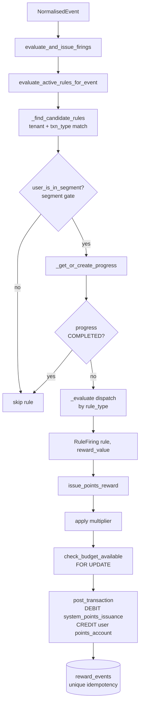

# 05 — Rewards, Rules & Referral

> **Purpose:** how the rule engine turns a normalised event into an idempotent points/cashback payout, and how
> the referral flow attributes and pays both sides.
> **Related:** [06 — Events Ingestion & Mode Awareness](06-events-ingestion-and-mode-awareness.md) (where events
> come from), [07 — Redemption & Reconciliation](07-redemption-and-reconciliation.md) (where points go),
> [03 — Money Controls](03-money-controls-pricing-limits-roles-step-up.md) (reward budgets, the ledger guard).
> **README anchor:** [§7 Rewards, rules & referral](README.md#7-rewards-rules--referral).
> **PRD modules:** 9 (Rules Engine), 10 (Reward Issuance), 15 (Audience Segmentation); referral Pay-PRD-0622.

---

## 1. The shape of the subsystem

Three things collaborate, all downstream of a single `NormalisedEvent` (an internal wallet transaction reshaped
by the outbox, or an external partner event — see doc 06):

1. **Evaluator** (`backend/app/modules/rules/evaluator.py`) — decides *which* rules a user just satisfied and by
   *how much*, tracking per-user progress. Six rule types run here.
2. **Issuer** (`backend/app/modules/rewards/service.py`) — moves the reward through the ledger idempotently.
3. **Referral** (`backend/app/modules/rules/referral_evaluator.py`) — a parallel, *non-dispatcher* path with its
   own attribution table and firing hooks.

The evaluator and issuer are joined by one DRY core, `evaluate_and_issue_firings`
(`backend/app/modules/events/service.py:170`), called by both the external-Kafka path and the internal outbox
drainer. It runs the evaluator, then `issue_points_reward` per firing, and reports the *post-multiplier* credited
value. It does **not** commit — the caller owns the transaction boundary.



Referral does **not** flow through this diagram — it has explicit entry points (§7).

---

## 2. Data model

| Table | File | Role |
|---|---|---|
| `rules` | `shared/models/rules.py:55` | Config row; `rule_type` decides which columns matter (single-table style). |
| `rule_conditions` | `rules.py:150` | Composite sub-conditions (`transaction_type`, `count_threshold`, opt `min_amount`, `sort_order`). |
| `user_rule_progress` | `rules.py:165` | Per-`(user_id, rule_id)` tracker, UNIQUE `uq_user_rule_progress`. |
| `reward_events` | `shared/models/rewards.py:25` | One row per firing; the idempotency ledger (§4). |
| `segments` / `segment_groups` / `user_segments` | `shared/models/segments.py` | Static + dynamic (criteria) cohorts inside exclusive-tier groups (§6). |
| `referral_codes` / `referrals` | `shared/models/referrals.py` | Code per user; referred→referrer attribution link (§7). |

`user_rule_progress` carries every counter any rule type needs: `current_count`, `current_streak`,
`trigger_count`, `last_triggered_at`, `last_qualifying_event_at`, `window_start`, and `status`
(`active`/`completed`/`deactivated`). One row serves all six dispatcher rule types; referral does **not** use it.

---

## 3. The evaluator and the 7 rule types

`evaluate_active_rules_for_event(session, event) -> list[RuleFiring]` (`evaluator.py:78`) is the entry point.
`RuleFiring` is a 2-tuple dataclass `(rule, reward_value)`. Flow per event:

1. **`_find_candidate_rules`** (`:130`) — active rules in the event's tenant where
   `rule.transaction_type == event.transaction_type`, **OR** a composite rule any of whose `rule_conditions`
   matches the event type.
2. **Segment gate** — if the rule is segment-bound (`segment_id` set), skip unless
   `user_is_in_segment(user, segment)` (`segments/service.py:159`).
3. **`_get_or_create_progress`** (`:163`) — INSERT-then-fetch, race-guarded against the
   `uq_user_rule_progress` unique constraint.
4. **Skip if progress is `COMPLETED`** (one-shot rules never re-arm).
5. **`min_amount` filter** (`:115`) — enforced in the caller for the types that declare it.
6. **`_evaluate` dispatch** (`:198`) by `rule_type`.

`SUPPORTED_RULE_TYPES` (`:56`) lists the **six** driven here. **Referral is deliberately absent** — it is not a
transaction-triggered dispatcher rule (§7).

> **Idempotency note.** The evaluator is *not* idempotent on its counter increments. Re-evaluation is prevented
> upstream — by the `event_ingestion_log` dedup (external) and the outbox `transaction_id` key (internal). Only
> the *issuance* is idempotent (§4). Never feed the same event twice.

### 3.1 Rule-type table

| Type | Fn | Trigger | Required config | Fires / reward | Progress fields | PRD |
|---|---|---|---|---|---|---|
| **first_time** | `_evaluate_first_time` `:220` | first matching event of `transaction_type` | `transaction_type`; `count_threshold` forbidden | once per user; `reward_value` | `trigger_count=1`, `status=completed` | 0617 |
| **milestone** | `_evaluate_milestone` `:235` | Nth matching event | `count_threshold` | `current_count >= threshold`; resets count if `resets_after_trigger`; stops at `stop_after_n_triggers` | `current_count`, `trigger_count` | 0540/0570/0580 |
| **value_based** | `_evaluate_value_based` `:275` | any single event ≥ `min_amount` | `min_amount>0` + `transaction_type` | every qualifying event; honours `stop_after_n_triggers` | `trigger_count`++ | 0618 |
| **campaign** | `_evaluate_campaign` `:299` | first-time semantics, date-gated | `campaign_start_date`/`end_date` + `transaction_type` | once, only if `event.date ∈ [start,end]` inclusive; else silent no-op | `trigger_count=1`, `status=completed` | 0619 (campaign) |
| **streak** | `_evaluate_streak` `:343` | N consecutive periods | `streak_units>=2`, `streak_unit_window` (`day`/`week`) | `current_streak >= streak_units`; resets to 0 if configured | `current_streak`, period index | — |
| **composite** | `_evaluate_composite` `:446` (async) | AND/OR over ≥2 conditions | `composite_operator` + `conditions[]` | operator satisfied | `window_start` | 0619/WAL-75 |
| **referral** | `referral_evaluator.py` | signup or Nth txn — **not** via dispatcher | `referral_trigger`, `referral_trigger_n`, `referee_reward_value` | §7 | uses `referrals` stamps | 0622 |

### 3.2 The subtle ones

- **streak period index** (`_streak_period_index` `:328`). A timestamp is mapped to an ordinal period: for
  `day`, the date's ordinal; for `week`, `ordinal // 7`. A second qualifying event *in the same period* is a
  no-op (streak already credited for that period). A gap of exactly one period advances the streak; a gap `>1`
  restarts it at `1`. This is why streaks count *periods*, not *events*.

- **composite counting** (`_count_qualifying_transactions` `:404`). A composite condition is not counted from
  the event stream — it is counted from the durable `transactions` table (COMPLETED rows of the condition's
  `transaction_type`, amount ≥ its `min_amount`, since `window_start`). This makes composite **source-agnostic**:
  it sees whatever actually settled on the ledger, regardless of which path produced it. `AND` fires when *every*
  condition's count meets its threshold; `OR` when *any* does. On fire, if `resets_after_trigger`, `window_start`
  advances to now; if `!resets_after_trigger` and the rule already fired once, a **one-shot guard** (`:481`)
  suppresses re-firing.

- **one-shot guards**. `first_time` and `campaign` set `status=completed` on fire, so step 4 of the evaluator
  never re-arms them. `composite` uses its explicit `window_start` + already-fired guard instead of the status
  flag (it may legitimately re-fire across windows).

> **Wiring gap (honest).** Composite's `transactions`-count and referral's `nth_transaction` count are
> forward-compatible but **not yet fed by the live transaction pipeline** — flagged in both evaluator docstrings.
> The `both`-mode outbox (doc 06) now delivers internal *events*, but the transaction-count *sources* those two
> paths read are not fully wired. Treat composite-count and referral-Nth as built-not-live. See README §10.

---

## 4. Reward issuance

Both issuers go through the ledger `post_transaction` choke point (doc 02) and are made idempotent by the
`reward_events` unique index `idx_reward_events_idempotency (user_id, rule_id, triggering_event_id)`
(`rewards.py:25`; NFR-0110, Pay-PRD-0620). `triggering_event_id` is free text — an internal txn UUID or an
external `event_id`.

### 4.1 `issue_points_reward` (`rewards/service.py:174`) — Pay-PRD-0530–0620

`DEBIT system_points_issuance / CREDIT user points_account`, currency `PTS` (`POINTS_CURRENCY`, `:48`).

Order of operations (the sequence is load-bearing):

1. **Fast path** — `_find_existing_reward_event` (`:157`); if this `(user, rule, event)` already fired, return
   it unchanged (no ledger write).
2. **Auto-provision** the user's `points_account` in `PTS` if absent (`_get_or_create_user_points_account`
   `:51`) — race-safe, no admin/audit. Points accounts are cheap and not KYC-gated, unlike financial wallets.
3. **Multiplier** — `resolve_multiplier_for_issuance` (WAL-78) is applied **before** the budget check and the
   ledger write: `effective_value = reward_value × multiplier`. Recorded on the row as `multiplier_applied`.
4. **Budget** — `check_budget_available` (Phase G.1) locks the budget row `FOR UPDATE` and raises
   `BudgetExceeded` (409) if the windowed cap is hit. The lock closes the check-then-spend race.
5. **Ledger** — `post_transaction` with txn type `reward_issuance` and a **deterministic** idempotency key
   `reward:{rule}:{user}:{event}`. The CREDIT leg's `ledger_entry_id` is linked back onto the reward row.
6. **`reward_events` insert** — on `IntegrityError` (concurrent duplicate), refetch the existing row and return
   it (no-op). Belt-and-braces on top of the fast path.

`system_points_issuance` is the per-`(tenant, currency)` points master
(`get_or_create_system_points_issuance` `:111`); a missing one raises `SystemPointsIssuanceMissing` (500 — an
operator provisioning error, never user-facing).

### 4.2 `issue_cashback_reward` (`rewards/service.py:376`) — Pay-PRD-0623

`DEBIT system_cash_inflow / CREDIT user financial_wallet`, real money in a real currency.

Differences from points:

- **No multiplier.** Multipliers are a points-only lever (Pay-PRD-0623) — cashback is paid at face value.
- **Wallets are not auto-provisioned.** `_find_user_financial_wallet` (`:313`) raises
  `UserFinancialWalletMissing` (422) if the user has no wallet in that currency (KYC-gated, unlike points).
- **Cap-exempt.** Passes `skip_receive_cap=True` — an earned reward may legitimately push a wallet past its
  `max_balance` and must never be blocked (invariant #11 corollary b, the fail-open credit rule).
- The float DEBIT is floored like any other float spend (invariant #6 float extension): cashback cannot be paid
  from an empty float. txn type `cashback_reward`, key `cashback:{rule}:{user}:{event}`.

Both `reward_issuance` and `cashback_reward` are **excluded** from `REWARDABLE_TYPES`, so a reward payout never
re-triggers the outbox and rewards can't loop (doc 06 §4).

---

## 5. Bonus multipliers & budgets

- **Multipliers (WAL-78)** — resolved inside `issue_points_reward` only, applied before budget + ledger. Points
  only; cashback ignores them entirely.
- **Reward budgets (WAL-50 / Phase G.1)** — `check_budget_available` (`budgets/service.py`) gates *every* points
  issuance behind a `FOR UPDATE` lock on the budget row; scopes are `none` / `tenant_only` / `rule_only` /
  `both` (`rules/service.py:226`). `BudgetExceeded` (409) is raised before the ledger write. Budgets are the
  admin's spend ceiling on the rewards programme.

---

## 6. Segments (Module 15)

Segmentation Phase 1 (2026-08) shipped both halves of Module 15: cohorts live inside **segment groups**
(`SegmentGroup` — one exclusive-tier lens per group, e.g. "Customer Loyalty"), and a segment can be **static**
(admin-assigned) or **dynamic** (criteria-evaluated). A `Segment` is UNIQUE per `(tenant, group, name)` — not
tenant-wide — since two different groups may legitimately reuse a tier name (e.g. "Gold" under both "Customer
Loyalty" and "Merchant Tiers"); a `UserSegment` is UNIQUE per `(user_id, segment_id)`. Within a group, membership
is exclusive: the highest-`priority` matching segment wins.

A static segment (`criteria IS NULL`) is admin-assigned via `POST /segments/{id}/users`. A dynamic segment
(`criteria` set — a flat AND/OR DSL v1 document validated by `app/modules/segments/criteria.py`) has its
membership computed by a batch evaluator (`app/modules/segments/evaluator.py`) on an hourly Celery-beat schedule
or on-demand via a manual recompute. Rules bind to a segment via `rules.segment_id` (nullable) regardless of
static/dynamic; the binding is settable at rule creation (`POST /api/v1/rules` accepts `segment_id`, 404
`segment_not_found` when it doesn't resolve in the tenant) and editable afterwards (`PATCH /api/v1/rules/{id}`
— targeting is an eligibility gate, not a trigger condition, so retargeting never corrupts in-flight progress;
an explicit `"segment_id": null` clears it). The Campaigns UI exposes this as a group → segment cascade
("Target audience": pick the segment group, then a segment within it) on both the create wizard and the edit
dialog, with the resolved "Group → Segment" audience shown in the detail drawer. The hot-path check is
`user_is_in_segment(session, *, user_id, segment_id) -> bool` (`segments/service.py`), called by both the
evaluator's candidate filter and the multiplier resolver.

Admin surface: `POST /segments`, `GET /segments`, `PATCH /segments/{id}` (description/group/priority/criteria —
`clear_criteria: true` turns a dynamic segment back to static), `POST /segments/{id}/users` (idempotent add,
cross-tenant → 404), `GET /segments/metrics` (criteria DSL metric vocabulary), `POST /segments/preview` (dry-run
match count for a not-yet-saved criteria document), `POST /segments/recompute` (enqueue an async evaluator run
for one tenant); `POST /segment-groups`, `GET /segment-groups`, `DELETE /segment-groups/{id}` (409 if
system-seeded or still holding segments). Admin UI (`/segments`) renders one collapsible section per group.

---

## 7. Referral end-to-end (Pay-PRD-0622)

Referral is intentionally *outside* the dispatcher. It has its own attribution table (`referrals`), its own
firing functions, and it never touches `user_rule_progress`.

### 7.1 Code generation & attribution (`modules/identity/service.py`)

- **Every** user is minted a referral code at `create_user` (`:419`) — `_create_unique_referral_code` (`:220`)
  retries against the `(tenant, code)` unique guard using an unambiguous alphabet (no `0/O/1/I`,
  `_generate_referral_code_value` `:213`).
- On the signup OTP path, `_assert_referral_code_exists` (`:281`) validates a supplied code **before** consuming
  OTP quota (`:1755`) — fail fast, don't burn an OTP on a bad code.
- **Attribution is written only when `self_registration=True` AND a `referral_code` is supplied** (`:428`): a
  PENDING `Referral(referred→referrer)` row is created. Admin / external / maker-checker created users pass
  `self_registration=False`, so their `referral_code` is **ignored** and they are never rewardable
  (anti-farming). **No reward is issued at creation** — attribution only.

### 7.2 Reward firing (`modules/rules/referral_evaluator.py`)

Two live entry points plus one built-not-wired:

- **`evaluate_referral_on_signup`** (`:220`) — fires all active `signup`-trigger referral rules for a referral;
  commits.
- **`evaluate_referral_on_registration_complete`** (`:261`) — the *real* signup hook. Called from **`set_pin`**
  (`identity/service.py:1870`) **post-commit and fail-open**, only when the *initial* registration PIN is set
  (i.e. a verified phone finished self-registration). No-op unless the caller is the referred party of a still
  **PENDING** referral, then delegates to `evaluate_referral_on_signup`. Firing at PIN-set — not at row creation
  — is what makes referral rewards require a *completed, verified* signup.
- **`evaluate_referral_on_transaction`** (`:315`) — `nth_transaction`-trigger rules; would fire when the
  referee's COMPLETED (optionally typed) transaction count ≥ `referral_trigger_n`, counting from the
  `transactions` table. **KNOWN GAP: not wired into the live transaction pipeline** (unit-tested,
  forward-compatible). See README §10.

### 7.3 Both-sided payout (`_fire_both_sides` `:174`)

- Rewards the **referrer** (`reward_value`) always; the **referee** only if `referee_reward_value > 0`.
- Each side is guarded by its own stamp — `referrer_rewarded_at` / `referee_rewarded_at` — so a re-run never
  double-pays a side; on success `status=REWARDED`.
- Points → `issue_points_reward`; cashback → `issue_cashback_reward` in the tenant base currency.
  `_ensure_user_account` (`:60`) provisions the referee's wallet/points account (a fresh referee has none).
- `triggering_event_id` is `referral_signup:{referral}:{rule}` (or `referral_nth:...`); the two sides differ by
  `user_id`, so they occupy distinct rows in the `reward_events` unique index — no collision.
- **Attribution invariant:** a reward fires *only* when a code was used. An organic signup writes no `referrals`
  row, so nothing can ever fire for it.

```mermaid
sequenceDiagram
    participant U as Referee (self-reg)
    participant ID as identity.create_user
    participant PIN as identity.set_pin
    participant RE as referral_evaluator
    U->>ID: signup + referral_code (self_registration=True)
    ID->>ID: write PENDING Referral(referred→referrer)
    Note over ID: no reward yet (attribution only)
    U->>PIN: set initial PIN (verified phone)
    PIN-->>PIN: commit signup
    PIN->>RE: evaluate_referral_on_registration_complete (post-commit, fail-open)
    RE->>RE: _fire_both_sides
    RE-->>U: referee reward (if referee_reward_value>0)
    RE-->>RE: referrer reward; stamps + status=REWARDED
```

---

## 8. Admin & mobile surfaces (Module 16)

- **Rules admin** (`modules/rules/router.py`, `/api/v1/rules`, `platform-admin`): create (persists rule +
  `rule_conditions`), list, per-rule + batch `/performance`, get, PATCH (editable fields only — trigger
  conditions are immutable), soft-delete (`status=inactive`; hard delete blocked by the `reward_events` FK).
  Schema validation (`rules/schemas.py:77`) enforces per-type field requirements and forbids cross-type field
  leakage.
- **Mobile catalog** (`modules/rewards/read_service.py`, on the identity router, user token): `GET /me/rewards`
  returns the eligible rule catalog + per-rule progress/status + ~20 recent firings + the user's own
  `referral_code` (surfaced regardless of `enabled`, so sharing is independent of the catalog).
  `POST /me/rewards/seen` clears the unseen badge (`seen_at IS NULL`). In `wallet` mode the catalog is empty and
  `enabled=false`, but the referral code is still returned.
- **Celebration.** Money paths return `earned_points` (e.g. the P2P response) via the outbox fast path
  (doc 06 §4); an unseen `reward_events.seen_at` drives the badge.
