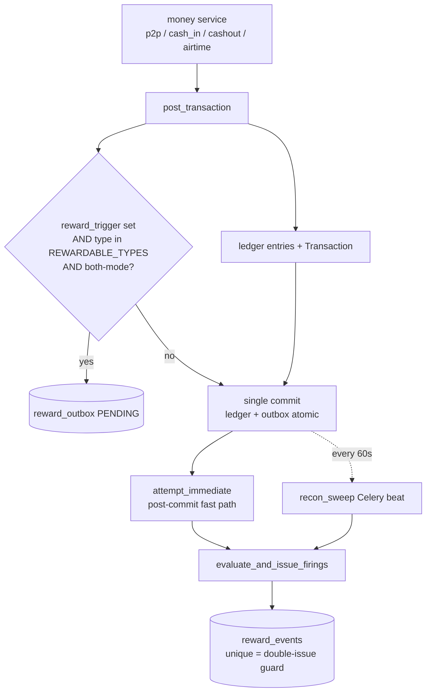

# 06 — Events Ingestion & Mode Awareness

> **Purpose:** how external partner events enter the platform (Module 8), how the per-tenant `business_type`
> decides which event source is live, and how a `both`-mode wallet drives its own rewards through a transactional
> outbox — plus an honest account of the Module 17 emission gap.
> **Related:** [05 — Rewards, Rules & Referral](05-rewards-rules-and-referral.md) (what an event fires),
> [02 — Ledger, Accounts & Money Movement](02-ledger-accounts-and-money-movement.md) (`post_transaction`, where
> the outbox row is written), [08 — Tenancy, Config & Provisioning](08-tenancy-config-and-provisioning.md).
> **README anchor:** [§3 Deployment modes](README.md#3-deployment-modes-tenantsbusiness_type--the-master-switch),
> [§7 Rewards](README.md#7-rewards-rules--referral).
> **PRD modules:** 8 (Event Ingestion, Pay-PRD-0480–0529), 17 (External Engagement Emission, Pay-PRD-1060–1120).

---

## 1. Two ways an event reaches the evaluator

A rule is only ever evaluated against a `NormalisedEvent`. There are exactly two producers of that type, and
which one is live for a tenant is decided by `business_type`:

| Producer | Source | Live in mode | Path |
|---|---|---|---|
| **External ingestion** | partner Kafka / HTTP | `rewards` only | `process_external_event` (§2) |
| **Internal outbox** | the tenant's own wallet transactions | `both` only | `reward_outbox` drain (§4) |

Both converge on the same DRY core `evaluate_and_issue_firings` (`events/service.py:170`, doc 05 §1). The mode
switch (§3) guarantees a tenant is never driven by *both* producers at once.

---

## 2. External event ingestion (Module 8)

`process_external_event(session, raw, *, raw_body, signature_header)` (`events/service.py:210`) is the single
pipeline — used identically by the synchronous HTTP endpoint and the Kafka consumer. Steps:

1. **Source lookup** by `source_key` → reject `source_not_registered` (404) if missing/inactive.
2. **Tenant scope** — the source's tenant must match the event's tenant → else `source_tenant_mismatch` (403).
3. **Mode gate** — `external_events_allowed(tenant)` (§3); false → reject `wrong_mode`. A `wallet`/`both` tenant
   never processes external events.
4. **HMAC proof-of-origin (Pay-PRD-0495)** — when the source has a `shared_secret_encrypted`: `decrypt_secret`
   (an `InvalidToken` → `integrity_check_failed`), require both `raw_body` and the `X-Sasai-Signature` header
   (else `integrity_check_missing`), then `verify_signature` (`app.auth.hmac`) else `integrity_check_failed`.
   Every rejection is `record_audit_for_system` + logged. A source with a NULL secret is unverified *test mode*.
5. **Dedup** — INSERT `EventIngestionLog` as `PROCESSED`; an `IntegrityError` on the
   `(source_key, external_event_id)` unique index means a duplicate → no-op `duplicate` outcome.
6. **Normalise** (§2.2).
7. **Evaluate + issue** — `evaluate_and_issue_firings`.
8. **Commit** — steps 5–7 land atomically; a failure rolls the whole event back.

### 2.1 Source registration

`register_source(session, request, *, admin, ip_address)` (`events/service.py:67`, `POST /events/sources`,
`platform-admin`) persists an `ExternalEventSource`: tenant-scoped `name`, globally-unique `source_key`,
`field_mapping` JSONB, and the shared secret **Fernet-encrypted at rest** (`shared_secret_encrypted`). A
duplicate key → `SourceKeyAlreadyInUse` (409); audit `event_source.registered`.

### 2.2 Normalisation

`normalise(raw, field_mapping)` (`normaliser.py:19`, Pay-PRD-0490/0510) maps a partner's raw payload onto the
frozen `NormalisedEvent` dataclass (`events/schemas.py:84`) and upper-cases currency. Today it is an identity
map (empty `field_mapping`); the JSONB column is reserved for per-partner schema translation without code
changes.

### 2.3 The Kafka consumer

`scripts/run_consumer.py` — consumer group `wallet-platform.events.external`, topic
`Topics.EVENTS_EXTERNAL` = `wallet.events.external` (`config.py:13`). Fresh DB session per message; it calls the
**same** `process_external_event`, so HMAC + dedup + mode gating are enforced identically on the async path.
**Partition key is `user_id`** (invariant #10 — preserves per-user event order); the dev simulator producer
(`events/router.py:225`) keys on `user_id` too.

Endpoints (`events/router.py`, `/api/v1/events`): `POST /sources` (register), `POST /external` (synchronous
single ingest, same path as the consumer, HMAC when a secret is set), and three `SIMULATOR_DEV_MODE`-gated dev
helpers (`/sim-ingest`, `/sim-bootstrap`, `/sim-kafka-produce`).

---

## 3. Mode awareness — the master switch

Resolved centrally in `shared/tenant_mode.py`, the single reader of `tenants.business_type`:

- `business_type_of(session, tenant_id) -> str` (`:18`) — raises `ValueError` if unset.
- `rewards_from_wallet_enabled(session, tenant_id) -> bool` (`:38`) — true only in `both`; **non-raising**
  (a hot path — degrades to `false` rather than 500).
- `external_events_allowed(session, tenant_id) -> bool` (`:53`) — true only in `rewards`.

| Mode | Wallet money paths | Rewards from wallet | External Kafka |
|---|---|---|---|
| `wallet` | live | none | rejected (`wrong_mode`) |
| `rewards` | — (rewards-only) | — | **only** source of events |
| `both` | live | via internal outbox | rejected (`wrong_mode`) |

The two gates are mutually exclusive by construction: a tenant is fed by external events (`rewards`) or by its
own wallet outbox (`both`), never both, and `wallet` mode issues no rewards at all.

---

## 4. The internal wallet→rewards transactional outbox (`both` mode)

In `both` mode there is **no external Kafka in the hot path**. Instead a completed rewardable wallet transaction
writes an outbox row *inside the same DB transaction* as the ledger commit, and a drainer turns it into rewards.

### 4.1 Outbox write (`modules/ledger/service.py:249-274`)

Inside `post_transaction`, a `RewardOutbox` row is added atomically with the ledger entries **iff all three**
hold:

1. `request.reward_trigger` is set — **only the money services pass it** (payments, cashin, cashout, airtime).
   Reward-issuance calls pass no trigger, which is what prevents payout loops.
2. `transaction_type ∈ REWARDABLE_TYPES = ("p2p", "cash_in", "cashout", "airtime_recharge")`
   (`rewards.py:84`) — a defense-in-depth re-check of the loop-safe allowlist.
3. `rewards_from_wallet_enabled(tenant)` — i.e. `both` mode.

The row reuses `txn.id` from the prior flush, so the outbox row and the ledger are committed together — the
classic transactional-outbox guarantee: no reward is ever owed for a transaction that rolled back, and none is
lost for one that committed. `airtime_recharge` fires only on the successful-vend *completion* commit, never on
the PENDING reservation.

### 4.2 Outbox drain (`modules/rewards/outbox.py`)

Constants: `MAX_ATTEMPTS = 5` (poison ceiling), `INTERNAL_SOURCE_KEY = "internal:wallet"`,
`_UNPROVISIONABLE = (UserPointsAccountMissing,)`.

- `_event_from_row` (`:60`) builds a `NormalisedEvent`; **`event_id = str(transaction_id)`** — the transaction id
  *is* the idempotency key, so re-draining the same row can't double-issue.
- `_drain_row` (`:82`) runs `evaluate_and_issue_firings`, then marks the row `PROCESSED`.
- **`attempt_immediate(session_factory, *, tenant_id, user_id)`** (`:145`) — the post-commit fast path that
  powers the mobile celebration. Fresh session, `FOR UPDATE SKIP LOCKED`, per-row commit. **Fail-open:** an
  `_UNPROVISIONABLE` error → `_mark_processed_noop` (`:123`); any other exception → `_record_failure` (`:101`,
  bumps `attempts`, sets `FAILED`); the recovery itself is wrapped so *nothing* escapes onto the money path.
- **`issue_immediate_points(session, *, tenant_id, user_id) -> int`** (`:228`) — the absolute fail-open wrapper
  money services call post-commit. Builds a fresh sessionmaker from `session.bind`, returns the total points
  issued (0 if nothing fired or not `both` mode). Wired into e.g. `payments/service.py:425` → surfaced as
  `earned_points` in the P2P response (`payments/schemas.py:88`) → drives the celebration.
- **`recon_sweep_async(session_factory, batch=100)`** (`:267`) — drains PENDING + FAILED rows with
  `attempts < MAX_ATTEMPTS`, oldest first, across all tenants; per-row commit; poison rows are left for a
  stuck-row alert.
- **`recon_sweep()`** (`:326`) — Celery `@shared_task(name="rewards.recon_sweep")`, scheduled **every 60s** in
  `celery_app.py:24` `beat_schedule`. Uses a dedicated NullPool asyncpg engine per run (avoids "event loop
  closed").

### 4.3 Why this is safe

- **Double-issue safety is the `reward_events` unique index, NOT the outbox row lock.** The per-row commit
  releases `FOR UPDATE`, so the immediate fast path and the sweep can touch the same row — worst case is a
  spurious `FAILED` that the sweep retries. The unique `(user_id, rule_id, triggering_event_id)` index is the
  real guarantee that a reward is issued at most once.
- **Fail-open everywhere.** Rewards must never break a money path. Both the fast path and the wrapper swallow all
  errors and record them; the money transaction has already committed by the time they run.
- **Reversal claw-back is DESIGNED, NOT BUILT.** `reward_outbox.transaction_id` is recorded so a future hook can
  reverse the reward when the underlying transaction is reversed — no such hook exists today. See README §10.

---

## 5. Module 17 — External Engagement Emission — **NOT IMPLEMENTED**

This module is a **genuine gap**, documented here honestly rather than described as if it exists.

- Two topics are **reserved** in `config.py:15-16`: `REWARDS_ISSUED = "wallet.rewards.issued"` and
  `ENGAGEMENT_OUTBOUND = "wallet.engagement.outbound"`.
- **No producer emits to either.** The only Kafka producer anywhere in the codebase is the dev-only
  `sim-kafka-produce`, which writes to `EVENTS_EXTERNAL` (inbound), not these.
- **No WebEngage / external-engagement connector exists.** There is no code that would push a reward-issued or
  engagement event outward to a CRM/marketing platform.

**Intended design (for when it is built):** on every reward issuance, emit a `wallet.rewards.issued` event
(`user_id` partition key, per invariant #10) after the DB commit; a separate engagement worker consumes it and
translates business signals into `wallet.engagement.outbound` events for a downstream engagement platform
(WebEngage was the named target). Until that ships, treat Pay-PRD-1060–1120 as **topic scaffolding only**.

---

## 6. PRD traceability

| Requirement | Where |
|---|---|
| Pay-PRD-0480/0490/0510 (ingest + normalise) | `process_external_event`, `normalise` |
| Pay-PRD-0495 (proof-of-origin HMAC) | step 4 above; enforced identically on HTTP + Kafka |
| Pay-PRD-0500 (dedup / exactly-once) | `event_ingestion_log` unique `(source_key, external_event_id)` |
| Mode awareness (spec 2026-08-03) | `shared/tenant_mode.py`; outbox gate in `post_transaction` |
| Pay-PRD-1060–1120 (Module 17 emission) | **NOT IMPLEMENTED** — §5 |
