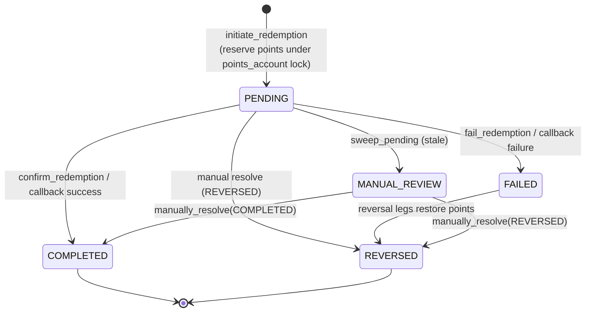

# 07 — Redemption & Reconciliation

> **Purpose:** how a user spends points on an external reward (Module 11) and how stuck redemptions are swept,
> escalated, and manually resolved without ever violating the append-only ledger (Module 12).
> **Related:** [05 — Rewards, Rules & Referral](05-rewards-rules-and-referral.md) (where points are earned),
> [02 — Ledger, Accounts & Money Movement](02-ledger-accounts-and-money-movement.md) (`post_transaction`, the
> balance guard), [03 — Money Controls](03-money-controls-pricing-limits-roles-step-up.md) (role/step-up gates).
> **README anchor:** [§5 The money core](README.md#5-the-money-core--one-choke-point-one-guard).
> **PRD modules:** 11 (Redemption, Pay-PRD-0660–0740), 12 (Reconciliation, Pay-PRD-0750–0800).

---

## 1. Overview

Redemption converts points into an external benefit (voucher, airtime, etc.) fulfilled by a third-party
provider. Because fulfilment is external and asynchronous, the redemption row is a **state machine**:
`PENDING → COMPLETED | FAILED | REVERSED`. Points are reserved on initiation and only truly spent on success; a
failure reverses the reservation. All money movement funnels through the ledger `post_transaction` choke point
(txn type `redemption`), so the append-only and idempotency invariants hold here as everywhere.

The one structural difference from other money paths: **redemption owns its own `points_account` FOR UPDATE
lock**, separate from the wallet balance guard. The wallet guard only guards `financial_wallet` and
`system_cash_inflow` — points accounts are *skipped* by it (doc 02). To prevent a points overdraft under
concurrency, redemption locks the user's points account itself at the choke point.

---

## 2. Redemption lifecycle (`modules/redemption/service.py`)

### 2.1 Provider registration

`register_provider` (`:115`, `POST /redemption/providers`, `platform-admin`) persists an external redemption
provider (name, callback config, retry/escalate policy, `status`). `_find_provider` (`:189`) resolves it;
inactive → `RedemptionProviderInactive` (409), missing → `RedemptionProviderNotFound` (404).

### 2.2 Initiation (`initiate_redemption` `:210`, `POST /redemption/initiate`, user, **[IDEM]**)

The gate order mirrors every money path, then the points-specific reservation:

1. **RBAC** — `require_permission` for `redemption`; reject **before** any wallet lookup or lock (`:255`).
2. **Step-up** — `enforce_step_up` runs after role but before any DB lock (`:259`).
3. **Access lock** — the redeeming user must be `active`; `txn_locked`/`suspended`/`closed` is blocked here
   (migration 0045, `:294`).
4. **Points reservation** — `lock_account_for_update(session, user_points.id)` (`:322`) locks the user's
   `points_account` `FOR UPDATE` (**redemption owns this lock** for points-overdraft serialisation), then posts
   a PENDING `redemption` transaction that DEBITs the points account. Overdraft on points is rejected under the
   lock — the derived points balance can't go negative.
5. **Provider dispatch after commit** — the external provider call happens only after the DB transaction closes
   (NFR-0130); the reservation is already durable as a PENDING row.

`_find_user_points_account` (`:93`) resolves the account; a missing one raises `UserPointsAccountMissing` (422).

### 2.3 Settlement transitions

The redemption reaches a terminal state through one of three doors, all converging on the same two internal
appliers:

| Door | Fn | Auth | Outcome |
|---|---|---|---|
| Provider callback | `process_provider_callback` (`:600`) | **HMAC** `X-Sasai-Signature` | COMPLETED or FAILED |
| Admin confirm | `confirm_redemption` (`:501`) | admin | COMPLETED |
| Admin fail | `fail_redemption` (`:550`) | admin | FAILED |

- **`_apply_completed_transition`** (`:454`) — moves the redemption + its PENDING ledger entries to COMPLETED.
  The reserved points become truly spent (the DEBIT settles). Requires the redemption to be PENDING, else
  `RedemptionNotPending` (409).
- **`_apply_failed_transition`** (`:479`) — the redemption FAILED; the points reservation is unwound by appending
  **opposite-direction** ledger legs (append-only, invariant #1 — never an UPDATE), restoring the user's points
  balance. The row moves to REVERSED.
- `process_provider_callback` verifies the HMAC signature in-service (public endpoint, HMAC-authenticated), then
  routes to the matching applier based on the provider's reported outcome. Retry/escalate behaviour comes from
  the provider's registered policy.

---

## 3. Reconciliation (`modules/reconciliation/service.py`)

Reconciliation is the safety net for redemptions that never got a callback. Auth on all endpoints is
`_require_finance_or_admin` (finance OR platform-admin realm role).

| Endpoint | Fn | Purpose |
|---|---|---|
| `POST /reconciliation/sweep` | `sweep_pending` (`:91`) | Find stale PENDING redemptions, escalate to `MANUAL_REVIEW`. |
| `GET /reconciliation/pending` | `list_pending` (`:182`) | List still-open redemptions. |
| `GET /reconciliation/manual-review` | `list_manual_review` (`:227`) | The human queue. |
| `POST /reconciliation/{id}/resolve` | `manually_resolve` (`:270`) | Force COMPLETED or REVERSED. |
| `GET /reconciliation/audit` | `query_audit_log` (`:399`) | Query the immutable audit trail (enriched). |

### 3.1 Sweep & escalate

`sweep_pending` finds PENDING redemptions older than the provider's escalation window and moves them to
`MANUAL_REVIEW` — it does **not** guess the outcome; a redemption whose external fate is unknown must be resolved
by a human, never auto-completed or auto-reversed (money-safety).

### 3.2 Manual resolution

`manually_resolve` (`:270`) requires the redemption to be in `MANUAL_REVIEW` (else
`RedemptionNotInManualReview`, 409) and an outcome of exactly COMPLETED or REVERSED (else
`InvalidResolveOutcome`, 422). A REVERSED resolution appends reversal legs via **`_flip_entries`** (`:377`) —
opposite-direction ledger entries against the *same* `transaction_id`, restoring the reserved points. This is the
append-only reversal pattern (invariant #1): the original entries are never touched; the balance nets out through
addition. Every resolution writes an `audit_log` row.

`query_audit_log` (`:399`) + `_enrich_audit_entries` (`:451`) render the audit trail human-readable — resolving
actor ids to display names (`_friendly_system_name` `:444` for system actors) and entity ids to names.

### 3.3 Celery beat status (honest note)

The reconciliation sweep is **admin/finance-triggered via `POST /reconciliation/sweep`** — it is **not** on a
Celery beat schedule. The only periodic job in `celery_app.py` `beat_schedule` is the *rewards* outbox sweep
(`rewards.recon_sweep`, every 60s — see [doc 06 §4.2](06-events-ingestion-and-mode-awareness.md)), which is a
different subsystem (draining unissued rewards, not resolving stuck redemptions). Redemption reconciliation stays
a deliberate, operator-initiated action.

---

## 4. Invariants preserved here

- **Append-only ledger (#1).** Every settlement/reversal (`_apply_failed_transition`, `_flip_entries`) appends
  opposite legs; no UPDATE/DELETE on `ledger_entries`.
- **Idempotency (#2).** `initiate_redemption` requires an `Idempotency-Key`; a replay returns the original
  redemption with no new reservation.
- **External calls after commit (#6/NFR-0130).** The provider is dispatched only after the PENDING reservation
  is committed; no external call happens inside a DB transaction or under a lock.
- **Points overdraft prevention.** Redemption's own `points_account` `FOR UPDATE` lock serialises concurrent
  redemptions so the derived points balance never goes negative — the wallet balance guard does not cover points
  accounts.

---

## 5. PRD traceability

| Requirement | Where |
|---|---|
| Pay-PRD-0660–0700 (redemption lifecycle) | `initiate_redemption`, `_apply_completed/_failed_transition` |
| Pay-PRD-0710 (provider callback + HMAC) | `process_provider_callback` |
| Pay-PRD-0720–0740 (points reservation / overdraft) | points_account `FOR UPDATE` lock at `:322` |
| Pay-PRD-0750–0780 (sweep + manual review) | `sweep_pending`, `list_manual_review`, `manually_resolve` |
| Pay-PRD-0790–0800 (audit query) | `query_audit_log` + `_enrich_audit_entries` |
